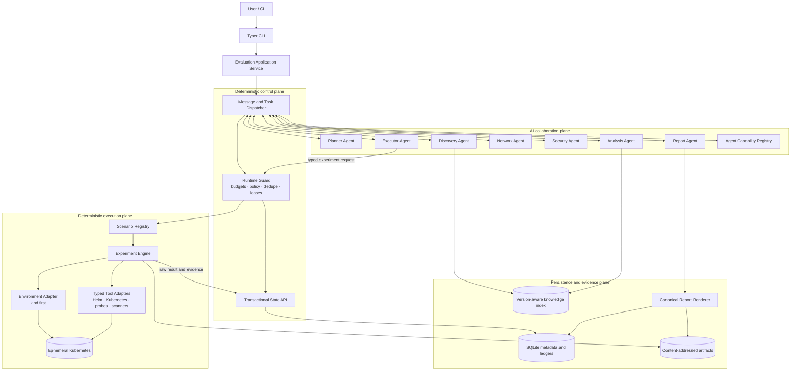
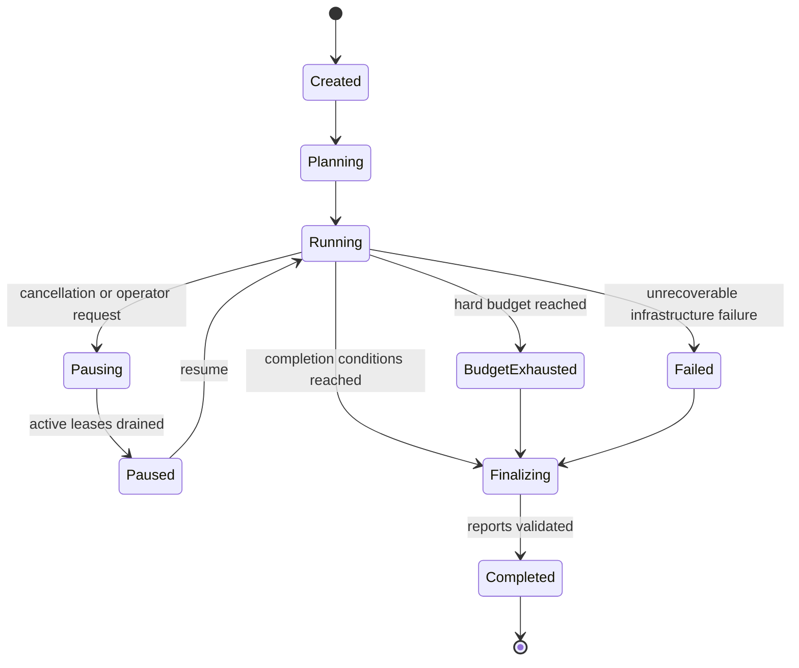
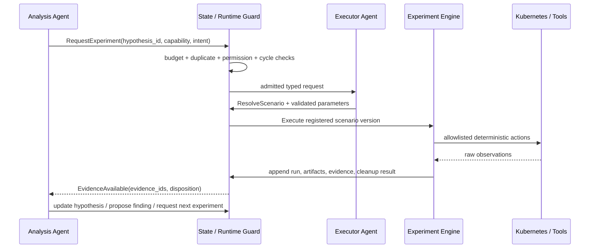

# Kubernetes Production Readiness Lab — Historical Architecture Proposal

| Field | Value |
|---|---|
| Status | **Historical exploration — not the KubeProof v0.1 implementation plan** |
| Milestone | 0 — Architecture |
| Audience | Senior engineers, maintainers, security reviewers, prospective contributors |
| Scope | Product architecture, boundaries, invariants, MVP and delivery roadmap |
| Last updated | 2026-09-21 |

> This document preserves the earlier full-platform design for future reference.
> KubeProof v0.1 deliberately uses a smaller architecture. The authoritative
> current direction is [`docs/v0.1/architecture.md`](v0.1/architecture.md), and
> its accepted output semantics are in
> [`docs/v0.1/truth-contract.md`](v0.1/truth-contract.md).

## Executive decision summary

Kubernetes Production Readiness Lab (`kube-lab`) will be a Python 3.12 modular
monolith that evaluates a Kubernetes product against an explicit company
profile. It will combine bounded AI reasoning with deterministic execution. AI
agents may plan, form hypotheses, request known experiments, interpret evidence
and draft evidence-linked findings. They may not execute arbitrary commands,
change historical observations, decide whether a deterministic check passed, or
turn documentation into runtime evidence.

The design uses a durable blackboard, typed peer-to-peer messages and a
capability registry. There is no strategic central supervisor. A deterministic
runtime still exists, because peer autonomy without admission control would make
budgets, security and consistency unenforceable. The runtime routes decisions
already made by agents; it does not decide the investigation strategy.

The persistent model is deliberately split:

- coordination projections are mutable under optimistic concurrency control;
- experiments, raw observations, evidence and audit events are append-only;
- invalidation and supersession are new records, never edits to old evidence;
- documentation claims live in a separate trust domain from measured evidence.

The initial execution environment is `kind`, selected over `k3d` because its
upstream-Kubernetes fidelity is more valuable for compatibility assessment than
the smaller footprint of K3s. This is **not** a strong isolation boundary.
Untrusted workloads must eventually run inside a disposable VM or equivalent
host sandbox; a local Docker-based cluster is suitable only for declared risk
classes. The report must expose this limitation.

There are two delivery scopes that must not be confused:

1. the first vertical slice proves Helm input → kind → install experiment →
   evidence → finding → JSON/Markdown report;
2. the product MVP adds the eleven experiment families listed in section 26.

No score is produced. The primary product is a reproducible evaluation bundle:
inputs, environment fingerprint, scenario versions, experiments, raw artifacts,
evidence, findings and reports.

---

## 1. Problem interpretation

### 1.1 The real decision being supported

The product is not an installer validator. It is a decision-support system for
adoption under constraints. Its output must answer four separate questions:

1. **What is the product?** Workloads, permissions, dependencies, operational
   components and documented requirements.
2. **What did we actually test?** Exact environment, scenario, inputs, timing
   and preconditions.
3. **What happened?** Immutable, attributable observations and raw artifacts.
4. **What does that mean for this company profile?** Findings linked to both
   evidence and constraints, including uncertainty and untested areas.

This separation prevents three common errors: treating installation as
readiness, treating vendor documentation as observed behavior, and presenting
LLM fluency as empirical confidence.

### 1.2 Primary users

- A platform/security engineer qualifying a product before an internal pilot.
- A product vendor validating compatibility against representative enterprise
  profiles.
- A consultant or internal enablement team publishing repeatable assessments.
- A maintainer reproducing a failure and verifying a remediation.

### 1.3 Quality attributes, in priority order

1. **Evidence integrity and provenance** — every supported conclusion is
   traceable to immutable source material.
2. **Safety and containment** — tested software and ingested content are
   untrusted.
3. **Reproducibility** — versions, inputs, environment and scenario definitions
   are captured.
4. **Explicit failure semantics** — infrastructure failure cannot be mistaken
   for product failure.
5. **Bounded autonomy** — agents can investigate locally but cannot escape
   budgets, permissions or the experiment catalogue.
6. **Extensibility** — new scenarios and infrastructure adapters do not weaken
   the core invariants.
7. **Understandability** — a contributor can explain the system without first
   learning an orchestration framework.

### 1.4 Non-negotiable invariants

- An accepted evidence-based finding references at least one existing,
  non-deleted evidence record.
- A documentation claim is never accepted as runtime evidence.
- Raw evidence is never updated or deleted through the application API.
- Every state mutation has actor, evaluation, correlation, timestamp and reason.
- Every experiment uses a registered scenario and validated typed parameters.
- Agents cannot invoke a general-purpose shell or raw `kubectl` tool.
- Runtime permission checks cannot be bypassed by agent-to-agent delegation.
- Product outcome and test-infrastructure outcome are modelled independently.
- A report cannot introduce evidence or findings absent from persisted state.
- Budget consumption is monotonic; retries do not refund budget.
- The same input and scenario version produce the same execution specification.
  Environmental observations may differ, but the planned action is
  deterministic.

### 1.5 Important correction to the initial framing

“No supervisor” must not be interpreted as “no scheduler, owner or consistency
boundary.” A system where agents directly mutate a shared object and invoke one
another recursively would be difficult to recover, audit or secure. The proposed
system removes **strategic supervision**, not deterministic control-plane work.
Agents decide why and what to investigate; the runtime decides only whether and
how an already-requested operation may execute.

---

## 2. Architectural proposal

### 2.1 Style

Use a modular monolith with ports and adapters. One process is enough initially,
but module boundaries anticipate separate worker processes without requiring
microservices now.

The system has five logical planes:

| Plane | Responsibility | May use an LLM? |
|---|---|---:|
| Interface | CLI, import/export, report access | No |
| Collaboration | Agents, plans, hypotheses, typed messages | Yes, bounded |
| Control | Admission, routing, budgets, concurrency, retries, policy | No |
| Execution | Scenarios, environment and tool adapters, cleanup | No |
| Evidence | Ledger, artifacts, finding gate, reports | Interpretation only |

The layers are logical, not separately deployed services. Domain types depend on
nothing infrastructure-specific. Application services depend on domain ports.
Adapters depend inward on those ports.

### 2.2 Why a custom runtime

The differentiating requirements are typed shared state, append-only facts,
capability-based peer delegation, strict experiment admission and explicit loop
control. A small custom runtime exposes these concepts directly. A graph or
agent framework would still need custom persistence and policy layers, while
also encouraging a central graph/supervisor model.

Alternatives:

- **LangGraph:** strong for explicit workflows and checkpoints, but a static
  control graph is not the primary abstraction here. It can be reconsidered if
  durable graph execution becomes harder than expected.
- **OpenAI Agents SDK:** useful tracing and handoffs, but would couple core
  collaboration semantics to one provider and would not replace the evidence
  ledger or experiment engine.
- **LangChain:** broad integration ecosystem, but too much abstraction surface
  for the narrow core needed in early milestones.
- **Temporal:** excellent durable execution, but operationally disproportionate
  for a local modular monolith. It becomes relevant only for remote, multi-hour,
  multi-worker evaluations.

The reversal criterion is concrete: reconsider the custom runtime if crash-safe
resume, distributed leasing or long-running orchestration consumes more project
effort than product-specific evaluation capabilities.

### 2.3 Component responsibilities

| Component | Owns | Explicitly does not own |
|---|---|---|
| Evaluation service | Evaluation lifecycle and top-level use cases | Investigation strategy |
| State store | Transactions, versions, facts, projections | Agent reasoning |
| Dispatcher | Delivering admitted messages and commands | Choosing goals |
| Runtime guard | Budgets, depth, permissions, dedupe, leases | Experiment pass/fail |
| Agent registry | Capability discovery and deterministic resolution | Hidden hard-coded calls |
| Agents | Plans, hypotheses, evidence interpretation, requests | Raw execution and direct state writes |
| Scenario registry | Trusted scenario definitions and schemas | Generated executable code |
| Experiment engine | Validated execution, collection, cleanup | LLM decisions |
| Evidence gate | Provenance and finding invariants | Narrative generation |
| Report service | Canonical JSON and Markdown rendering | New facts or findings |
| Knowledge service | Version-aware document claims and retrieval | Behavioral proof |

---

## 3. Mermaid architecture diagram



The arrows do not grant write authority. Every collaboration or execution write
passes through the transactional state API and runtime guard, even when the
logical request is peer-to-peer.

---

## 4. Runtime architecture

### 4.1 Runtime model

The runtime is a command-driven dispatcher around a durable state store. It has
no prompt that asks “what should happen next?” It processes commands already
chosen by users or agents:

1. validate command schema and actor identity;
2. load the minimum relevant state snapshot;
3. check evaluation status, capability and permissions;
4. check budget, depth, duplicate and cycle policy;
5. acquire a task/experiment lease using compare-and-swap;
6. append admission and invocation events;
7. invoke the addressed agent or deterministic engine;
8. validate its structured output;
9. atomically append facts and update coordination projections;
10. emit follow-up events/messages requested by that output.

### 4.2 Lifecycle



An evaluation can finalize with unresolved hypotheses. `Completed` means the
evaluation bundle is internally valid, not that the product is production-ready.

### 4.3 Concurrency and consistency

- Coordination rows carry a monotonic `revision` used for optimistic locking.
- Tasks and experiments have leases with owner and expiry, not permanent locks.
- Fact insertion and projection updates occur in one database transaction.
- An outbox record is created in that same transaction; dispatch occurs after
  commit, preventing “state updated but message lost.”
- Handlers are idempotent by command ID. Re-delivery returns the recorded result.
- SQLite is configured for WAL mode, but the initial process retains a bounded
  write queue. This avoids pretending SQLite is a distributed coordination
  system.

### 4.4 Budgets and loop control

`ExecutionBudget` contains hard limits and current monotonic consumption:

- agent calls and LLM tokens;
- experiments and destructive/safety-weighted experiment cost;
- wall-clock deadline;
- active concurrency;
- delegation depth;
- retries per task and per operation class;
- optional money/cost ceiling.

Depth is carried as causal metadata (`parent_call_id`, `root_call_id`, `depth`),
not inferred from the Python stack. A peer response does not automatically create
a new call; only a new admitted message consumes one.

Duplicate detection uses canonical fingerprints:

- task: evaluation + normalized goal + subject + constraint + input revision;
- hypothesis: normalized statement + affected component + evaluation;
- experiment: scenario version + normalized parameters + environment snapshot +
  product input digest.

A duplicate may link to an existing object or intentionally rerun it when the
request declares a repetition purpose, such as confirming reproducibility. It
must never be silently discarded.

Cycle detection examines the causal message graph and repeated state transitions.
The runtime stops a branch when it sees no information gain after a configured
number of attempts. “Information gain” is deterministic: new evidence IDs,
changed hypothesis status, new product revision, or a materially different
experiment fingerprint. Semantic novelty is not delegated to another LLM call.

### 4.5 Failure semantics

Use two orthogonal axes:

- `ExecutionDisposition`: completed, infrastructure_failed, timed_out,
  cancelled, cleanup_failed, rejected;
- `ProductObservation`: passed, failed, degraded, inconclusive,
  not_applicable, not_observed.

For example, a pod that does not recover after a correctly applied pod-kill
experiment is `completed + failed`. An unreachable Kubernetes API is
`infrastructure_failed + not_observed`. A cleanup failure is recorded even when
the experiment observation is valid.

Retries are permitted only for classified transient infrastructure failures and
idempotent phases. A product failure is not retried merely to seek a passing
result. Repeated trials are new experiments with an explicit statistical or
reproducibility purpose.

---

## 5. Shared state model

`EvaluationState` is a read model assembled from normalized persisted records,
not one giant JSON document. Passing the whole evaluation to every agent would
recreate the prompt-size and information-loss problems the blackboard is meant
to solve.

### 5.1 Logical aggregate

```text
EvaluationView
├── context: EvaluationContext
├── product: ProductProjection
├── company_profile: CompanyProfileSnapshot
├── environment: EnvironmentSnapshot | None
├── coordination
│   ├── current_plan: EvaluationPlan
│   ├── tasks: TaskRegistry
│   ├── hypotheses: HypothesisRegistry
│   ├── investigation_branches: BranchRegistry
│   └── messages: MessageIndex
├── factual
│   ├── product_artifacts: ProductArtifactLedger
│   ├── experiment_runs: ExperimentLedger
│   ├── observations: ObservationLedger
│   ├── evidence: EvidenceLedger
│   ├── documentation_claims: DocumentationClaimLedger
│   └── audit_events: AuditLedger
├── assessments
│   ├── constraint_results: ConstraintEvaluationRegistry
│   └── findings: FindingRegistry
└── control
    ├── budget: ExecutionBudget
    ├── capability_snapshot: AgentRegistrySnapshot
    └── status: EvaluationStatus
```

### 5.2 Mutable coordination versus immutable fact

| Mutable projection | Append-only source/history |
|---|---|
| Current task status/assignee/priority | TaskCreated, TaskAssigned, TaskTransitioned |
| Current plan revision | PlanRevisionCreated with parent revision |
| Hypothesis working status | Hypothesis events and evidence links |
| Current retry/lease state | Attempt and lease events |
| Finding workflow status | Finding revisions and validation decisions |
| Current evidence reliability view | EvidenceAssessment events |

Hypotheses are coordination state because their interpretation evolves. The
statement originally asserted and each transition remain auditable. Findings are
versioned assessments: correcting wording creates a new revision; it never
changes the evidence it cited at publication time.

### 5.3 State access contract

Agents receive a bounded `AgentContext` with selected IDs and projections. They
return typed proposals such as `CreateTask`, `RequestExperiment`,
`LinkEvidenceToHypothesis`, `ProposeFinding` or `SendMessage`. They never receive
a mutable repository object.

The `StateStore` port exposes use-case methods rather than a generic dictionary:

- append immutable fact;
- transition task with expected revision;
- publish message;
- admit experiment request;
- record evidence assessment;
- create finding revision;
- query a purpose-specific snapshot.

This is more verbose than a shared dictionary, but it makes invariants testable
and state conflicts explicit.

---

## 6. Planner architecture

The Planner runs at evaluation start and only on explicit replanning triggers. It
receives product input descriptors, the immutable company-profile snapshot,
available agent/scenario capability summaries, user intent and budget—not raw
tool access.

Its output is a validated `PlanProposal` containing:

- objective and exclusions;
- ordered phases but not a globally fixed execution sequence;
- tasks, dependencies, priority and suggested capability;
- investigation questions and initial hypotheses;
- relevant scenario families and preconditions;
- completion conditions and “not tested” boundaries;
- risk assumptions and budget allocation suggestions.

The application service commits the proposal as plan revision 1 after structural
validation. The Planner is not allowed to execute experiments or silently expand
scope.

Replanning requires a typed reason:

- `scope_changed`;
- `critical_new_product_fact`;
- `plan_dead_end`;
- `capability_set_changed`;
- `budget_reallocation_requested`.

Local discoveries should normally add or reprioritize tasks directly. Calling the
Planner because one DNS dependency was found would be unnecessary centralization.
A complete replan is justified only when that discovery invalidates major plan
assumptions.

Planner evaluation checks constraint coverage, dependency validity, scenario
availability, completion conditions, bounded scope and forbidden operations.
Plan quality is evaluated separately from prose quality.

---

## 7. Peer-to-peer agent communication

Peer-to-peer is a logical collaboration protocol over a durable message bus. It
is not a direct `analysis_agent.network_agent()` call and not an in-memory chat
transcript.

### 7.1 Message envelope

Each `AgentMessage` has:

- message, evaluation, correlation and causation IDs;
- sender agent instance and capability used;
- either a concrete recipient or a required capability;
- intent enum;
- optional task, hypothesis, experiment and evidence references;
- typed payload selected by intent;
- priority, deadline, depth and idempotency key;
- content trust labels and source references;
- delivery and processing status.

Supported initial intents:

- delegate task;
- request analysis;
- request experiment;
- request information;
- provide result;
- challenge finding;
- propose plan update;
- request validation;
- escalate uncertainty.

Payloads are discriminated Pydantic models, not `dict[str, Any]`. Human-readable
notes are allowed as explanation, never as the sole carrier of executable
parameters.

### 7.2 Routing

The sender chooses the intent and either recipient or required capability. If a
capability is specified, the registry resolves it using deterministic eligibility
rules: enabled status, supported product/environment, safety clearance, current
lease capacity, then stable priority/name ordering. Load is a tie-breaker, not a
reasoning decision.

The routing decision and candidate set are logged. If no eligible agent exists,
the message becomes `unroutable`; the associated task can become `unsupported`
or `requires_manual_investigation` rather than disappearing.

### 7.3 Conversation constraints

- Messages carry references, not copied evidence blobs.
- An agent must resolve referenced evidence through the state API.
- Untrusted excerpts retain their trust label across messages.
- A challenge cannot delete a finding; it creates a validation task or finding
  revision.
- Delegation does not transfer permissions. The recipient is independently
  authorized.

---

## 8. Agent Registry

The registry stores versioned `AgentDescriptor` records:

- stable agent type and implementation version;
- provided capabilities and accepted message intents;
- supported input/output schema versions;
- allowed state queries and proposed commands;
- allowed tool classes (normally none; Executor is special);
- compatible environments and scenario categories;
- concurrency and cost metadata;
- trust/safety clearance;
- health and enabled state.

Registration is explicit at process startup in the MVP. Reflection-based
auto-discovery is avoided because it can unintentionally expand the available
authority. A snapshot of the registry is stored with each evaluation so a later
report can explain which capabilities were available.

The initial seven agents remain coarse-grained:

| Agent | Primary capabilities |
|---|---|
| Planner | create initial plan, full replan |
| Discovery | structure product inputs, propose investigation tasks |
| Analysis | correlate evidence, manage hypotheses, propose findings |
| Executor | translate request into a registered scenario invocation |
| Network | analyze network/DNS evidence and propose network experiments |
| Security | analyze RBAC/workload security evidence and propose tests |
| Report | synthesize existing accepted state only |

Resource, reliability, storage, upgrade and knowledge agents are added only if a
single existing agent develops conflicting responsibilities, prompts too broad
to evaluate, or independently scalable work. Taxonomy alone is not sufficient
reason to create an agent.

---

## 9. Analysis ↔ Executor loop



### 9.1 Responsibility boundary

The Analysis Agent states the question and required discriminating evidence. The
Executor Agent selects an available scenario and parameters; it does not decide
whether the hypothesis is true. The engine executes; it does not interpret. The
Analysis Agent interprets evidence, but the evidence gate decides whether the
proposed finding satisfies structural grounding rules.

### 9.2 Termination states

A hypothesis ends as `confirmed`, `disproven`, `inconclusive`, `blocked`,
`unsupported` or `requires_manual_investigation`. `Resolved` is a derived grouping
for confirmed/disproven, not an ambiguous status alongside them.

The loop stops when the hypothesis reaches a terminal state, required evidence
criteria are met, no registered experiment can discriminate alternatives, budget
is exhausted, or consecutive experiments add no information. These reasons are
persisted and reported.

---

## 10. Deterministic Experiment Engine

### 10.1 Execution contract

An experiment request names a registered scenario version and typed parameters.
The engine materializes an immutable `ExecutionSpec` containing:

- scenario and implementation digest;
- environment and product snapshots;
- normalized parameters;
- precondition checks;
- action sequence and per-action timeout;
- expected evidence schemas;
- resource and permission envelope;
- cleanup and restoration plan.

The engine runs phases: validate → prepare → baseline capture → inject/action →
observe → restore → cleanup → verify cleanup → seal evidence. Each phase emits an
audit event. Cleanup runs in a shielded, bounded phase even after cancellation;
failure is explicit and may quarantine the environment.

### 10.2 No arbitrary shell

Some necessary tools, notably Helm and kind, are command-line programs. “No
shell” therefore means:

- no `shell=True`, shell strings, pipes, substitutions or redirections;
- executable paths are configured and verified;
- argument vectors are produced by typed adapters with strict allowlists;
- user values cannot become flags outside their declared field;
- working directories and readable files are capability-scoped;
- stdout, stderr, exit code, duration and tool version are captured;
- secrets are redacted before logs but retained only in a protected artifact when
  absolutely necessary.

Agents never see a generic command adapter. `HelmInstall`, `KindCreateCluster`,
`InspectRbac`, `ApplyNetworkPolicy` and `ProbeDns` are separate operations.

### 10.3 Environment provider

Define an `EnvironmentProvider` port with create, fingerprint, health, quarantine
and destroy operations. `KindEnvironmentProvider` is first. Future EKS/GKE/AKS
providers implement the same lifecycle but may reject scenarios that cannot be
safely supported.

**kind versus k3d:**

| Criterion | kind | k3d |
|---|---|---|
| Distribution fidelity | Upstream Kubernetes node images | K3s distribution |
| Local startup/footprint | Good, generally heavier | Excellent |
| Kubernetes version testing | Direct and common in upstream CI | Coupled to K3s packaging |
| Built-in conveniences | Minimal | Registry, load balancer and K3s conveniences |
| Risk of distribution-specific behavior | Lower for generic Kubernetes | Higher when target is not K3s |

Choose kind because this product evaluates compatibility across Kubernetes
products, making upstream behavior the better neutral baseline. k3d remains a
future environment provider for users targeting K3s specifically. kind itself
states that it does not provide state-of-the-art security; this supports the
decision to treat it as reproducible infrastructure, not as the final sandbox.

Network-policy experiments require a policy-enforcing CNI. Do not silently
assume kind's default networking provides it. At the network milestone, add a
version-pinned `kind-cilium` environment profile and record Cilium as part of the
environment fingerprint. Calico is the simpler alternative; Cilium is preferred
only if its flow evidence materially reduces custom network instrumentation.
That choice remains a separate benchmark/ADR, not an implicit dependency now.

### 10.4 Composable enterprise environments

The environment model must describe the platform in which the company will
actually run the product, not only the Kubernetes version. A typed
`EnvironmentBlueprint` composes:

- cluster provider, Kubernetes version, topology, runtime and node architecture;
- substrate components such as CNI, DNS and storage;
- platform add-ons such as service mesh, policy engine, ingress, certificate,
  secrets and observability components;
- installed versions, artifact digests and explicit configuration;
- component dependencies/conflicts and installation order;
- declared capabilities plus readiness and conformance probes;
- safety controls, resource baseline and known limitations.

`CompanyProfile` and `EnvironmentBlueprint` have different semantics. The
profile is normative—what the company requires or forbids. The blueprint is
executable—what kube-lab should provision. After provisioning, an immutable
`EnvironmentSnapshot` records what was actually observed. A declared capability
is not trusted until its probe succeeds.

For example, an enterprise blueprint may provision kind with a pinned Cilium
configuration and later compose Istio ambient as a platform add-on. ztunnel is
then an environment component whose effect on the product can be investigated;
it is not conflated with the product or with Cilium itself.

An `EnvironmentVariant` is a typed delta over a baseline. An
`EvaluationCampaign` can run independent child evaluations for:

```text
baseline: kind + Cilium
variant:  kind + Cilium + Istio ambient/ztunnel
```

Every child normally uses a fresh cluster and factual ledger while sharing
product, company-profile and scenario inputs by digest. This supports controlled
A/B attribution. A separate transition scenario may deliberately enable ambient
mode on an already-running product when the question is migration impact rather
than steady-state comparison.

Environment components are trusted infrastructure selected by the operator and
installed through registered component adapters. Their resource use is captured
before product installation as environment baseline, not charged to the product.
If Cilium, Istio or another component is itself the system under test, it changes
role: its behavior becomes product evidence and containment must come from the
outer isolation tier.

The initial progression remains incremental:

1. Milestone 1 persists a minimal kind + kindnet blueprint;
2. the networking milestone adds Cilium as a registered substrate component;
3. one service-mesh variant validates cross-component composition;
4. Calico or another CNI validates substrate substitution;
5. larger matrices are created only for a stated product question.

The complete model and ztunnel example are specified in
`docs/environment-model.md`. ADR-013 records this direction.

---

## 11. Domain model

### 11.1 Main bounded contexts

| Context | Core concepts |
|---|---|
| Evaluation | Evaluation, campaign, scope, status, completion condition |
| Environment | Blueprint, component, variant, capability, snapshot, baseline |
| Product | Product input, artifact, component, dependency, discovered observation |
| Constraints | Company profile, requirement, constraint, evaluation result |
| Planning | Plan revision, task, branch, hypothesis |
| Collaboration | Agent descriptor, capability, message, invocation |
| Experimentation | Scenario definition, request, run, action, outcome |
| Evidence | Observation, evidence, artifact, provenance, assessment |
| Findings | Finding revision, evidence link, remediation, confidence |
| Knowledge | Document source, chunk, documentation claim, retrieval result |
| Reporting | Report snapshot, section, reproduction bundle |

### 11.2 Identity and time

Use opaque UUIDs generated by the application and UTC-aware timestamps. Human
readable slugs are separate and not primary keys. Every persisted model has a
schema version. External resource identity uses stable tuples such as cluster,
API group, kind, namespace, name and observed UID.

### 11.3 Product representation

`ProductProjection` is a derived view over immutable inputs and discovery
observations. It contains components, workloads, images, RBAC, services, ports,
storage, CRDs, webhooks, endpoints and relationships. Each field retains origin:
rendered manifest, live API observation, document claim or inferred relation.
This prevents a discovered document statement from masquerading as a rendered
resource.

### 11.4 Requirement versus constraint

A `Requirement` describes something the product or user says is needed. A
`Constraint` describes what the target company permits or requires. A
`ConstraintEvaluation` compares a product observation/evidence to a constraint
and records `satisfied`, `violated`, `unknown`, `not_applicable` or `not_tested`.
Conflating these would make “the vendor requires cluster-admin” look like an
enterprise policy rather than a compatibility conflict.

### 11.5 Status discipline

Do not use one generic status enum. Task, hypothesis, experiment, evidence,
finding and constraint evaluation have distinct state machines. Transitions are
validated by domain services and include a reason. This makes illegal states—for
example a completed experiment with no terminal execution disposition—harder to
represent.

---

## 12. Constraint DSL

### 12.1 API decision

Use explicit typed constructors and composition:

```python
profile = CompanyProfile.compose(
    BaseEnterprise(),
    AWSProfile(region="eu-west-1"),
    StrictSecurity(),
    NoPublicInternet(proxy_required=True),
).require(
    MaxMemoryPerPod("2Gi"),
    MinimumReplicas(2),
)
```

This is illustrative API shape, not implementation code.

Prefer `compose()` and `require()` over operator `+`. Addition hides conflict and
precedence semantics and is harder to discover in an IDE. Composition fails on
conflicting values by default. An override must name the affected constraint and
reason explicitly; order alone never decides policy.

### 12.2 Model

`CompanyProfile` contains metadata and typed category models for Kubernetes,
security, networking, DNS, resources, availability, scheduling, storage and
operations. Reusable profile fragments return constraints; they are not mutable
subclasses with inheritance precedence.

Every atomic constraint declares:

- stable key and category;
- value and unit/domain type;
- requirement level: required, preferred or forbidden;
- applicability selector;
- source/rationale;
- static and runtime evaluator capabilities;
- enforcement support, if any;
- serialization schema version.

Resource quantities use a dedicated Kubernetes quantity value object instead of
plain strings after parsing. Kubernetes versions are semantic versions with an
explicit skew/range policy. Registries, CIDRs, DNS names and API groups receive
specific validated types.

### 12.3 Evaluation semantics

Constraints are data; deterministic evaluator plugins perform checks against
evidence and product observations. An LLM may explain a result or identify a
missing evaluator, but may not turn an unknown into satisfied/violated.

Each result names the constraint, evaluator version, input evidence and reason
code. Unsupported, not applicable and not tested are distinct. Enforcement—for
example applying a default-deny policy—is a scenario precondition/action, not the
same operation as evaluation.

### 12.4 Serialization

Python is the primary authoring interface. Canonical JSON is the persistence and
exchange representation. YAML import/export is optional and uses safe parsing;
it never becomes the source of dynamic Python execution. A profile can be loaded
from a Python module only under the user's local trust boundary. A future hosted
service must not import arbitrary user Python and will accept canonical JSON or a
restricted declarative format.

---

## 13. Scenario plugin architecture

### 13.1 Definition

A scenario is trusted, versioned code registered at startup. It declares:

- stable ID, semantic version and implementation digest;
- category and description;
- typed parameter model;
- supported environment capabilities;
- preconditions and incompatibilities;
- required tool capabilities and permission envelope;
- expected evidence types/schemas;
- action timeout, total timeout and resource limits;
- safety level and destructive scope;
- cleanup/restoration contract;
- idempotency/repeatability properties.

Scenario code implements a narrow lifecycle interface. It receives an
`ExperimentContext` containing typed tool ports, a scoped artifact writer and
read-only snapshots. It does not receive the state store, arbitrary filesystem
or network client.

### 13.2 Discovery and trust

The MVP uses an explicit first-party registry. Python entry points can later load
installed plugins, but only from an administrator allowlist with package version
and digest captured. Remote scenario code, LLM-generated executors and runtime
`eval` are forbidden.

### 13.3 Versioning

Changing parameters, action semantics, expected evidence or cleanup behavior
creates a new scenario version. Historical runs retain the original version and
implementation digest. Schema migrations may upgrade metadata views but may not
reinterpret raw observations invisibly.

### 13.4 Scenario validation tests

Every scenario must have contract tests for parameter rejection, precondition
failure, timeout, cancellation, evidence sealing, partial execution, cleanup and
cleanup failure. Riskier scenarios require a disposable-environment E2E test.

---

## 14. Evidence model

### 14.1 Evidence is a first-class immutable record

An `Evidence` record contains:

- evidence ID, evaluation ID and schema version;
- kind and subject/component references;
- source class: Kubernetes API, event, log, metric, probe, scanner, Helm,
  static-analysis tool, runtime or experiment observation;
- collector and collector version;
- experiment/run/action references, when applicable;
- capture start/end and ingestion timestamp;
- environment and product revision references;
- normalized typed payload or artifact reference;
- raw artifact content digest, size, media type and redaction metadata;
- provenance chain and collection error status;
- reliability assessment references.

Large logs, packet captures and scanner output live in the artifact store. The
database stores metadata, selected normalized fields and SHA-256 digests.

### 14.2 Observation, evidence and claim

- **Raw observation:** direct tool output or measurement, potentially noisy.
- **Evidence:** sealed observation with provenance and a schema suitable for
  analysis.
- **Documentation claim:** attributed statement extracted from an untrusted
  document and tied to source/version/span.
- **Finding:** interpretation of evidence relative to risk or constraints.

Static analysis can produce evidence about the supplied/rendered artifact, for
example “container securityContext.runAsUser is absent.” It is not runtime
evidence. The evidence kind makes that scope explicit.

### 14.3 Immutability and assessment

Evidence has no update method. A separate `EvidenceAssessment` can mark it
`accepted`, `questioned`, `unreliable`, `superseded` or `invalidated`, with actor,
reason and replacement references. Existing findings keep their original link
and are revalidated when an assessment changes.

Deletion for legal or secret-handling reasons is a privileged tombstone/purge
workflow. The audit record and digest remain where policy permits; reports become
explicitly non-reproducible rather than silently changing.

### 14.4 Reproducibility bundle

Each publishable evaluation includes canonical manifests for input digests,
profile, tool versions, scenario versions, environment, ordered experiment runs,
evidence index, artifact digests, findings and report. Reproduction instructions
must state which external inputs are mutable and pin OCI/chart digests whenever
possible.

---

## 15. Finding model

### 15.1 Finding fields

A versioned `Finding` contains title, severity, workflow status, basis, affected
components, related constraints, description, evidence links, confidence
assessment, reproduction steps, impact, remediation options, limitations,
author/agent, timestamps and supersession references.

`basis` is one of:

- runtime evidence;
- static evidence;
- documentation only;
- not tested;
- manual review required.

Hypotheses remain separate objects. They should not be displayed as confirmed
findings merely by selecting a weak status label.

### 15.2 Evidence gate

Before a finding can become `accepted` or `published`, a deterministic validator
checks:

- evidence IDs exist in the same evaluation;
- evidence subject and time window are relevant;
- invalid evidence is not the sole support;
- runtime claims cite runtime evidence;
- constraint claims cite the exact profile snapshot and evaluation result;
- reproduction steps reference an executable scenario or explicitly say manual;
- infrastructure failure is not described as product failure;
- severity and confidence use defined rubrics.

Documentation-only/not-tested/manual-review items use their explicit basis and do
not pretend to be evidence-backed findings.

### 15.3 Confidence and severity

Avoid an unexplained numeric confidence. Use `low`, `moderate` or `high` plus a
structured assessment of directness, collector reliability, repeatability,
independence and environmental representativeness. The displayed level is
derived by a documented rule. An LLM may propose factor explanations but cannot
override the rule.

Severity uses impact and adoption-blocking criteria, not generic prose. A finding
can be high severity with moderate confidence; keeping these dimensions separate
is essential.

### 15.4 Reporting constraint

The Report Agent receives immutable report input IDs and produces section
summaries. A report validator extracts every factual assertion that declares a
result and verifies attached references. Canonical JSON is generated entirely
from state. Markdown may include LLM-authored connective prose, but only around
existing facts/findings, and it must remain regenerable without the LLM using a
deterministic template.

---

## 16. MCP architecture

### 16.1 Role of MCP

MCP is an adapter boundary, not the internal architecture. It is useful when
tools or knowledge providers run out of process, need independent ownership, or
must be consumed by other clients. Wrapping every internal Python function in
MCP would add serialization and security surface without value.

For the first vertical slice, use direct typed Python adapters. Introduce MCP in
Milestone 11 for selected external integrations after the underlying contracts
are stable.

### 16.2 Tool shape

Expose task-specific tools such as `inspect_rbac`, `collect_pod_status`,
`run_dns_outage_scenario` and `query_product_docs`. Never expose `run_shell` or a
general raw `kubectl` proxy. Each tool has typed input/output, maximum result
size, timeout, required scopes, read/write/destructive annotations, idempotency
metadata and audit correlation IDs.

MCP tool annotations are hints, not enforcement. The kube-lab client maintains
its own trusted-server allowlist and permission policy. Tool output is untrusted
data even when the server is trusted.

### 16.3 Placement

The Experiment Engine—not ordinary agents—is the MCP client for mutation-capable
experiment tools. Knowledge/read-only tools may be exposed to agents through a
sanitizing application port. Credentials are scoped per server and evaluation;
servers never inherit broad host credentials.

Prefer local stdio for single-user trusted development because it avoids a
listening network service. Remote HTTP requires authenticated identities,
least-privilege scopes, TLS, exact host/origin policy, response limits and SSRF
controls. Protocol version is pinned and recorded.

---

## 17. RAG architecture

### 17.1 Pipeline

```text
Source acquisition
  → immutable raw document + digest
  → safe parsing / normalization
  → structural section extraction
  → version attribution
  → deterministic chunking
  → metadata and text index
  → optional embedding index
  → version-filtered retrieval
  → attributed DocumentationClaim
```

Sources include README files, official docs, release notes, Helm values/schema,
CRD OpenAPI schemas, compatibility matrices and architecture references. Each
source records product, exact or inferred version, URI/repository path, commit or
digest, release date, ingestion time, media type, trust label and parser version.

### 17.2 Version correctness

Retrieval applies hard product/version filters before ranking. Exact version,
declared compatible range and unknown version are different match classes. A
cross-version fallback is allowed only when requested and is visibly labelled;
it can create a knowledge gap, never silent evidence for the target version.

Incremental ingestion keys documents by content digest and source identity.
Changed documents create new records/chunks; old versions remain queryable. A
chunk cannot be reassigned to a new product version after ingestion.

### 17.3 Retrieval technology

Start with SQLite FTS5 plus metadata filtering. It is transparent, local and
adequate before corpus size or semantic-recall evals justify embeddings. Add an
embedding adapter and a local vector index only after a benchmark shows missed
queries that lexical/hybrid retrieval cannot solve. A distributed vector
database is explicitly outside the MVP.

Alternatives include PostgreSQL full text/pgvector (good for a future service),
Qdrant (strong vector features but another service) and hosted vector stores
(operational ease but cost, privacy and vendor coupling). None currently solves
a demonstrated MVP problem.

### 17.4 Claims, not facts

Retrieved text becomes `DocumentationClaim` with exact citations and source
spans. Claim extraction may use an LLM, but the original text and extraction
model/prompt version are retained. A claim can guide a hypothesis—such as an
air-gap promise—but cannot satisfy a runtime compatibility constraint.

---

## 18. Security model

### 18.1 Trust boundaries

The system treats product charts, manifests, images, hooks, CRDs, webhooks,
documentation, tool output, MCP servers and external endpoints as untrusted to
different degrees. The host, Docker daemon and evaluator credentials are
high-value assets. The AI model is not a policy enforcement point.

The principal boundaries are:

1. CLI user ↔ application;
2. application/agents ↔ experiment engine;
3. engine ↔ container runtime and ephemeral cluster;
4. cluster control plane ↔ tested workload;
5. workload ↔ network/metadata/external services;
6. ingestion parser ↔ untrusted content;
7. local process ↔ MCP/external providers;
8. metadata database ↔ raw artifact store.

### 18.2 Isolation tiers

| Tier | Intended input | Environment | Policy |
|---|---|---|---|
| 0: static only | Unknown/malicious artifact | No workload execution | Parse/render in restricted process |
| 1: local lab | Known public chart, bounded risk | kind on developer Docker | High-risk features rejected by preflight |
| 2: disposable sandbox | Unknown images/hooks | Dedicated ephemeral VM + kind | Default for adversarial execution |
| 3: external cluster | Organization-managed target | Explicit provider/credentials | Read-only by default, scenario allowlist |

The MVP can deliver tiers 0 and 1, but must not market tier 1 as safe for malicious
images. Docker-based Kubernetes nodes share the host kernel, and the orchestrator
needs powerful container-runtime access. Namespace isolation and Pod Security do
not eliminate container escape or daemon compromise.

### 18.3 Threats and controls

| Threat | Preventive controls | Detection/recovery | Residual risk |
|---|---|---|---|
| Malicious Helm chart/hooks | `helm template` preflight; hooks disabled until inspected; schema/size limits | Record rejected objects and reasons | Template complexity and Helm bugs |
| Malicious image/container escape | Tier policy; non-privileged workload; seccomp; no host mounts; disposable VM for unknowns | Runtime/audit events; destroy VM | Kernel/runtime zero-days |
| Privilege escalation | Pod Security Restricted baseline; admission policy; drop capabilities | Inspect live pod specs and admission events | Product may be untestable under profile |
| hostPath/hostNetwork/hostPID | Static reject or explicit high-risk tier | Evidence and finding | Required products may need manual isolated test |
| cluster-admin RBAC | Preflight RBAC diff; deny escalation/bind/impersonate; scoped install identity | Kubernetes audit and RBAC inspection | CRDs/webhooks still cluster-scoped |
| Secret access | Per-evaluation credentials; no host secrets; synthetic secrets | API audit and canary detection | Application can exfiltrate secrets it legitimately receives |
| Cloud metadata access | No cloud credentials in local tier; egress deny metadata CIDRs | Flow/probe evidence | IPv6/alternate metadata paths need coverage |
| Egress exfiltration | Default deny; DNS/egress allowlist; no sensitive input | Flow logs and destination evidence | CNI/instrumentation gaps |
| Resource exhaustion/DoS | Container, namespace and Docker/VM limits; quotas; deadlines | Metrics, watchdog, environment quarantine | Local host pressure in tier 1 |
| Malicious CRD/webhook | Preflight schemas; deny unsafe conversion/webhook destinations; isolated cluster | API discovery/audit, forced teardown | API-server denial inside disposable cluster |
| Compromised dependency/tool | Pinned versions/digests, checksum verification, minimal tools | SBOM/CI scanning, recorded versions | Supply-chain compromise remains possible |
| Artifact secret leakage | Size limits, redaction pipeline, protected raw store | Secret scanner, retention/purge policy | Redaction false negatives |
| Prompt injection | Trust-labelled content and capability separation | Injection evals and decision audit | Model-level defenses are probabilistic |

### 18.4 Installation policy

Preflight rendering happens before cluster mutation. It inventories hooks,
cluster-scoped objects, RBAC, host access, privileged settings, external images,
webhooks and resource requests. Policy either admits, rejects, or requires a
higher isolation tier. User override is explicit, recorded and unavailable in a
hosted multi-tenant context without stronger isolation.

---

## 19. Prompt-injection threat model

### 19.1 Trust hierarchy

From highest to lowest authority:

1. compiled application security invariants and runtime policy;
2. operator configuration and approved company profile;
3. authenticated user evaluation intent;
4. validated typed collaboration messages;
5. tool observations and retrieved documentation;
6. product-supplied README, values, manifests, labels, logs and error messages.

Lower layers are data and cannot redefine instructions from higher layers.
Agent-produced text is also not automatically trusted; only validated typed
commands acquire authority.

### 19.2 Controls

- Keep untrusted content out of system/developer prompt sections.
- Wrap excerpts in explicit data envelopes carrying source and trust labels.
- Retrieve the smallest necessary excerpt; do not inject entire repositories.
- Separate extraction prompts from action-capable agents where practical.
- Require structured outputs and reject unknown fields/action types.
- Resolve all actions through allowlisted capabilities and runtime admission.
- Prevent tainted text from populating executable names, paths, URLs or tool
  arguments without field-specific validation.
- Use egress allowlists and SSRF protection, so a successful textual injection
  still lacks network authority.
- Treat logs and MCP responses as equally injectable as documentation.
- Record concise decision summaries and source IDs for suspicious decisions.
- Include adversarial fixtures in every agent and knowledge-pipeline eval suite.

Content sanitization alone is insufficient; removing phrases such as “ignore
previous instructions” is easy to evade and can damage legitimate docs. The
security property comes from capability separation and deterministic validation,
with prompt hardening as defense in depth.

---

## 20. Observability

Use correlated structured events across evaluations, tasks, messages,
invocations, tool actions, experiment phases, evidence and findings. Required
fields include IDs, actor/capability, model/provider where applicable, tool and
scenario versions, duration, attempt, token/cost usage, outcome class, exception
class and evidence references.

Do not persist private chain-of-thought. Persist instead:

- selected task and capability;
- decision summary and concise rationale;
- considered evidence/hypothesis IDs;
- requested experiment and parameter justification;
- validation/rejection reason;
- model request metadata and output schema validity;
- token counts and latency.

Use standard Python logging with `structlog` JSON rendering initially.
OpenTelemetry is the future interoperability layer for traces and metrics, added
when there is more than one process or an observability backend in integration
tests. A local run should not require a collector.

Key operational metrics include admission rejections, queue/lease time, agent
and tool latency, token/cost consumption, experiment/cleanup failures, evidence
counts by source, invalid output rate, duplicate suppression/link rate,
convergence stops and report validation failures.

Logs are diagnostic data, not automatically evidence. Experiment logs become
evidence only after sealing through the evidence pipeline with provenance and
redaction.

---

## 21. Agent evaluation strategy

Agent evals use fixed fixtures, recorded tool outputs and seeded model settings
where supported. They score structured decisions, coverage and violations—not
similarity to one ideal paragraph.

| Eval family | Assertion |
|---|---|
| Planner coverage | Critical profile constraints produce tasks or explicit exclusions |
| Planner validity | Dependencies are acyclic and capabilities/scenarios exist |
| Grounding | Every proposed evidence-based finding cites available relevant IDs |
| Hallucination trap | Plausible but absent evidence is never cited/created |
| Doc/runtime separation | Air-gap claim remains a claim until runtime test exists |
| Executor selection | Request maps to a compatible registered scenario and valid parameters |
| Infrastructure classification | API/tool failure is not blamed on product |
| Loop convergence | Repeated no-information results reach a terminal state within budget |
| Dedupe | Semantically identical typed requests link rather than multiply |
| Tool failure | Timeout/malformed/unavailable responses produce explicit branch outcomes |
| Prompt injection | Malicious docs/logs cannot cause unauthorized commands or state changes |
| Delegation | Capability routing reaches an eligible peer without Planner mediation |
| Budget | Calls, experiments, depth, retries, deadline and tokens are enforced |
| Report fidelity | Report contains no finding absent from input snapshot |

Use three layers:

1. deterministic contract evals with a fake LLM and exhaustive edge cases;
2. model behavior evals over a versioned golden corpus;
3. end-to-end scenario evals with recorded and live kind environments.

Track precision/recall for required tasks/findings where a labelled corpus
exists, plus forbidden-action rate, unsupported-claim rate, convergence rate,
cost and latency. A model or prompt change cannot merge if it improves prose but
regresses grounding or policy compliance.

---

## 22. Testing strategy

### 22.1 Test pyramid

- **Unit:** domain state machines, constraint parsing/evaluation, fingerprints,
  budget accounting, evidence gate, scenario parameter validation.
- **Property-based:** profile composition conflicts, status transitions,
  idempotency and serializer round trips.
- **Contract:** scenario lifecycle, tool adapters, environment providers, LLM
  provider adapters, artifact stores and MCP clients.
- **Integration:** SQLite transactions/outbox, Helm rendering, Kubernetes fake or
  API fixtures, artifact sealing and report generation.
- **E2E:** pinned charts in disposable kind clusters, including cleanup and
  reproducibility assertions.
- **Security:** malicious manifests/docs/logs, path traversal, argument injection,
  SSRF, oversized output and secret-redaction fixtures.
- **Evals:** non-deterministic agent quality tests isolated from correctness CI.

### 22.2 CI lanes

Fast required CI runs formatting, lint, typing, unit and contract tests. A Linux
integration lane runs SQLite and tool adapters. A privileged, isolated E2E lane
runs kind with strict time/resource limits. Model evals run on recorded fixtures
for pull requests; live-provider evals are scheduled or manually approved to
control cost and variability.

### 22.3 Test fixtures and product neutrality

Use purpose-built tiny Helm charts to trigger each behavior; do not make a large
third-party product the only regression fixture. Published evaluations of
ingress-nginx, cert-manager, Argo CD and Prometheus can be separate reproducible
acceptance cases with pinned versions/digests and neutral wording.

### 22.4 Definition of done enforcement

Feature checklists are backed by CI where possible: type check, tests, explicit
error taxonomy, structured logs, evidence schema, cleanup test, documentation
and safety classification. “Produces evidence” is tested by schema and provenance
assertions, not by inspecting report prose.

---

## 23. Persistence strategy

### 23.1 MVP storage

Use SQLite in WAL mode for metadata, coordination projections, append-only
ledgers, outbox and FTS5. Use a content-addressed local artifact directory for
large/binary raw data. An evaluation has its own exportable bundle manifest but
does not require one database per run.

Use SQLAlchemy 2 Core and Alembic rather than a domain ORM. Pydantic owns domain
validation; SQLAlchemy Core provides explicit SQL, transactions and a credible
path to PostgreSQL. Alembic makes schema evolution reviewable. The cost is two
model representations and mapping code, accepted in exchange for preventing the
persistence model from becoming the domain model.

Alternatives:

- raw `sqlite3`: smallest dependency, but migration/transaction patterns and a
  future PostgreSQL move become bespoke;
- SQLAlchemy ORM: productive CRUD, but identity/session behavior can obscure
  append-only boundaries;
- event sourcing framework: strong audit semantics, but unnecessary framework
  and projection complexity; a factual ledger plus explicit events is enough;
- PostgreSQL now: better concurrency/JSON/querying, but violates local-first,
  zero-service setup for no current need.

### 23.2 Artifact integrity

Artifacts are written to a temporary file, size-limited, hashed, optionally
redacted/compressed, atomically moved under their digest, then referenced in the
same logical sealing operation. Orphan detection reconciles files and database
records after crashes. Never interpolate an untrusted filename into the store
path.

### 23.3 Recovery and migration

On restart, expired leases return eligible work to the queue; idempotency keys
prevent duplicate effects. In-progress experiments are classified based on
recorded phase and environment health. Cleanup is attempted before resumption.

The storage ports allow PostgreSQL and S3-compatible artifacts later. Migration
is triggered by concurrent writer demand, remote service operation, artifact
volume or retention needs—not merely by the possibility of future SaaS.

---

## 24. Repository structure

```text
kubernetes-production-readiness-lab/
├── src/kube_lab/
│   ├── domain/                 # pure models, enums, invariants, state machines
│   │   ├── evaluation/
│   │   ├── product/
│   │   ├── constraints/
│   │   ├── planning/
│   │   ├── experimentation/
│   │   ├── evidence/
│   │   ├── findings/
│   │   └── knowledge/
│   ├── application/            # use cases, commands, queries, ports
│   ├── runtime/                # dispatcher, guard, budgets, leases, outbox
│   ├── agents/
│   │   ├── planner/
│   │   ├── discovery/
│   │   ├── analysis/
│   │   ├── executor/
│   │   ├── network/
│   │   ├── security/
│   │   └── reporting/
│   ├── registry/               # agent and scenario registries
│   ├── experiments/
│   │   ├── installation/
│   │   ├── network/
│   │   ├── dns/
│   │   ├── security/
│   │   ├── resources/
│   │   ├── reliability/
│   │   └── upgrade/
│   ├── adapters/
│   │   ├── kubernetes/
│   │   ├── helm/
│   │   ├── kind/
│   │   ├── environment/
│   │   │   ├── cni/
│   │   │   ├── service_mesh/
│   │   │   ├── policy/
│   │   │   └── observability/
│   │   ├── scanners/
│   │   ├── llm/
│   │   └── mcp/
│   ├── persistence/
│   │   ├── sqlite/
│   │   └── artifacts/
│   ├── knowledge/              # ingestion, chunking, retrieval implementation
│   ├── reporting/              # canonical JSON and Markdown renderers
│   ├── observability/
│   ├── config/
│   └── cli/
├── tests/
│   ├── unit/
│   ├── property/
│   ├── contract/
│   ├── integration/
│   ├── e2e/
│   ├── security/
│   └── evals/
├── fixtures/                   # intentionally small charts/manifests/doc attacks
├── examples/                   # profiles and CLI examples
├── evaluations/                # published, pinned evaluation bundles
├── docs/
│   ├── architecture.md
│   ├── threat-model.md
│   ├── evaluation-model.md
│   ├── constraints.md
│   └── adr/
├── migrations/
├── scripts/                    # bounded developer/CI automation, not agent tools
├── pyproject.toml
├── Makefile
├── Dockerfile
├── compose.yaml                # optional observability/dev services only
├── CONTRIBUTING.md
├── SECURITY.md
└── README.md
```

The key improvement over a feature-only tree is the separation of domain,
application ports and adapters. `experiments/` contains trusted scenario logic;
generic Kubernetes/Helm mechanics live under adapters. This prevents every
scenario from inventing its own subprocess and evidence behavior.

---

## 25. Initial dependencies and technology choices

Dependencies are added in the milestone that needs them, not all at project
creation.

| Technology | Why it is needed | Alternatives | Trade-off / decision |
|---|---|---|---|
| Python 3.12+ | AI ecosystem, Kubernetes clients, typed DSL, contributor accessibility | Go, Rust, TypeScript | Choose Python; slower runtime is irrelevant beside cluster/LLM latency. Pin one supported minor in CI while declaring range deliberately. |
| Pydantic 2 | Runtime validation, discriminated unions, JSON Schema, serialization | dataclasses + manual validation, attrs, msgspec | Choose Pydantic at boundaries/domain DTOs; cost is dependency and model mapping. Avoid using it as persistence ORM. |
| Typer | Typed, discoverable CLI with subcommands | argparse, Click | Choose Typer for UX and low boilerplate; keep use-case logic outside decorators. |
| Kubernetes Python client | Typed API operations, watches and auth handling | raw HTTP, `kubectl`, kr8s | Choose official client; avoid exposing raw kubectl. Generated models are verbose but auditable. |
| Helm CLI adapter | Correct rendering/install/upgrade semantics | Helm Go SDK via service, reimplementation, pyhelm wrappers | Use pinned Helm binary through strict argv adapter. It is external-process complexity but preserves real Helm behavior. |
| kind CLI adapter | Reproducible upstream local clusters | k3d, minikube, vcluster | Choose kind for neutral Kubernetes fidelity; isolation remains weak. |
| SQLAlchemy 2 Core | Transactions, explicit persistence, future PostgreSQL path | sqlite3, ORM, SQLModel | Choose Core at persistence milestone; mapping boilerplate buys clear boundaries. |
| Alembic | Reviewable DB migrations | bespoke SQL migration runner | Choose with SQLAlchemy; small cost, standard workflow. |
| SQLite + FTS5 | Zero-service metadata, blackboard and lexical retrieval | PostgreSQL, document DB | Choose for local modular monolith; bounded writer concurrency. |
| Local content-addressed store | Large immutable artifacts and portable bundles | DB BLOBs, S3/MinIO | Choose filesystem first; add S3 adapter only for remote operation. |
| `structlog` | Consistent structured context and JSON logs | stdlib logging only, Loguru | Choose thin structlog configuration; no logging calls in pure domain types. |
| pytest | Broad Python testing ecosystem | unittest | Choose pytest with clear marker/lane policy. |
| Hypothesis | State-machine and composition properties | hand-written cases only | Add where invariants justify it, especially profiles and state transitions. |
| Ruff | Fast formatter/linter/import checks | Black + isort + Flake8 | Choose one fast tool and minimize config. |
| mypy | Strict static checks and plugin ecosystem | Pyright | Choose mypy initially because CI portability is simple; reconsider based on contributor IDE needs. Do not run both without a concrete gap. |
| Jinja2 | Deterministic Markdown templates | f-strings, Markdown builder | Add only when report templates become non-trivial; canonical JSON needs none. |
| PyYAML safe loader | Kubernetes multi-document parsing and optional YAML import/export | ruamel.yaml | Choose safe parsing for generated manifests; preserve raw YAML separately because comments/round trips are not core. |
| HTTPX | Bounded async HTTP for approved acquisition/probes | requests, aiohttp | Choose when networking/RAG acquisition needs it; enforce redirect, DNS, size and SSRF policy in an adapter. |
| LLM provider SDKs | Concrete provider adapters | provider-neutral raw HTTP | Optional extras only. Core depends on `LLMClient` protocol and its own request/response types. |
| OpenTelemetry | Cross-process traces/metrics later | vendor SDK, logs only | Defer until multi-process or collector-backed integration. Keep trace IDs in logs from day one. |
| MCP Python SDK | Standards-based external tool boundary | custom RPC/HTTP | Defer to Milestone 11; adopt only for genuine out-of-process integrations. |

Do not add Tenacity initially: bounded retry policy is part of runtime semantics
and should not be hidden in decorators. Do not add an AI orchestration framework
until a measured runtime requirement exceeds the custom design.

### 25.1 LLM abstraction

`LLMClient` accepts a typed request with purpose, model policy, structured-output
schema, redacted context references, timeout and token limit. It returns content,
usage, provider request ID and finish/error metadata. Provider adapters translate
this contract. Model selection belongs to configuration/policy, not agents.

Malformed output gets one bounded schema-repair attempt where permitted. Failure
becomes an explicit invocation result; the runtime does not silently parse prose
or retry indefinitely. The deterministic vertical slice should operate without
an LLM, proving AI is an enhancement to investigation rather than the source of
truth.

### 25.2 ADR plan

ADR-001 through ADR-013 live under `docs/adr/`. Each contains
Context, Decision, Alternatives, Consequences and Risks. This document remains
the system overview; ADRs explain individual irreversible or costly choices.
ADR-007 is accepted after review of the input-trust boundary; the others remain
proposed until their respective decisions are reviewed.

---

## 26. MVP scope

### 26.1 First vertical slice acceptance criteria

Input is one pinned public Helm chart reference and a minimal Python company
profile. The CLI:

1. validates and snapshots input;
2. creates a named ephemeral kind cluster;
3. pre-renders and performs safety preflight;
4. installs using the typed Helm adapter;
5. waits for bounded readiness;
6. captures Kubernetes/Helm evidence and raw artifacts;
7. creates at least one rule-based finding or explicit successful observation;
8. uninstalls, checks leftovers and destroys/quarantines the cluster;
9. emits canonical JSON and deterministic Markdown.

No multi-agent runtime or LLM is needed to prove this slice. This is intentional:
it validates the evidence and execution spine before adding reasoning complexity.

### 26.2 Product MVP capabilities

The product MVP is complete when one chart can run, within supported safety
limits, these versioned scenario families:

1. Helm installation/readiness/timeout;
2. RBAC inspection;
3. privileged and root/security-context checks;
4. resource requests and limits;
5. external endpoint discovery, with known visibility limits;
6. blocked egress behavior;
7. DNS failure and recovery;
8. pod kill and recovery;
9. Helm upgrade;
10. failed upgrade/rollback;
11. uninstall and leftover cleanup.

It also includes the Python constraint DSL, shared state/runtime, minimal
Planner/Discovery/Analysis/Executor collaboration, evidence-gated findings,
Markdown/JSON reports, threat model, automated tests and one publishable pinned
example evaluation.

### 26.3 CLI shape

Use an evaluation ID as the durable handle:

```text
kube-lab evaluate --chart <ref> --version <version> --profile <python-ref>
kube-lab evaluation status <evaluation-id>
kube-lab report render <evaluation-id> --format markdown|json
kube-lab evidence show <evidence-id>
kube-lab findings list <evaluation-id>
kube-lab scenarios list
kube-lab agents list
kube-lab profile inspect <python-ref>
```

`inspect` may perform static analysis without execution. `evaluate` must print
the isolation tier, planned mutating scope and output directory before starting.
In non-interactive CI, required acknowledgements are explicit flags/policy, never
implicit prompts.

---

## 27. What not to build

Do not build in the MVP:

- web UI, SaaS control plane, authentication, billing or multi-tenancy;
- microservices, distributed queues, Temporal or a Kubernetes Operator;
- cloud cluster provisioning or credentials for EKS/GKE/AKS;
- arbitrary shell, raw general-purpose kubectl or dynamic LLM-generated code;
- a distributed vector database or broad web crawler;
- a generic plugin marketplace or untrusted plugin loading;
- dozens of domain-named agents;
- a production-readiness score or LLM-generated pass/fail;
- automatic remediation of the evaluated product;
- packet capture by default; it is high-volume and potentially sensitive;
- support for every chart source, OCI registry and authentication mode;
- “enterprise-grade” kind isolation claims;
- a custom CRD for kube-lab itself.

Also avoid implementing the complete final state model before the vertical slice
shows which evidence and lifecycle data are actually needed. Preserve the
invariants now, then add fields driven by scenarios.

---

## 28. Technical risks

| Risk | Why it matters | Mitigation / early test |
|---|---|---|
| False confidence from weak isolation | The evaluator may run hostile code near developer assets | Explicit tiers; preflight deny; disposable VM design spike before unknown inputs |
| Observability changes behavior | CNI/proxies/collectors can alter network and resource findings | Fingerprint instrumentation; minimal baseline; compare instrumented/uninstrumented runs |
| Kubernetes nondeterminism | Scheduling, pulls and controllers produce timing variance | Separate deterministic spec from observed result; capture timestamps; repeat only intentionally |
| Evidence volume and secrets | Logs/scans can be huge and sensitive | Limits, targeted capture, CAS, redaction, retention policy, protected raw tier |
| Helm hooks and cluster-scoped resources | Can bypass namespace assumptions | Render/preflight, hook policy, isolated cluster, scoped installer, cleanup inventory |
| Cleanup is incomplete | Webhooks/finalizers/CRDs can wedge deletion | Time-bounded cleanup, forced environment destruction, quarantine evidence |
| LLM produces plausible unsupported claims | Core product credibility depends on grounding | Typed IDs, evidence gate, report validator, adversarial evals |
| Agent loops consume budget | Peer autonomy can amplify calls | Causal depth, monotonic budgets, fingerprints, no-information convergence checks |
| Custom runtime grows into framework | Infrastructure work can eclipse product value | Implement only milestone needs; decision checkpoint after Analysis↔Executor slice |
| Profile semantics become ambiguous | Composition conflicts could invalidate conclusions | Explicit conflict errors, atomic keys, evaluator reason codes, property tests |
| Version-aware RAG metadata is missing/wrong | Cross-version contamination creates bad guidance | `unknown` is explicit; hard filters; source digest/version evidence; no silent fallback |
| External endpoint discovery is incomplete | Encryption, DNS cache or startup timing can hide dependencies | State coverage/limitations; combine static, DNS, flow and failure experiments |
| Upgrades risk data loss | Rollback may not reverse CRD/data migrations | Synthetic data fixtures, scenario-specific backup, disposable environment, explicit limitation |
| Published evaluations age quickly | Product/chart/Kubernetes versions change | Immutable dated bundles; never present old results as current |
| SQLite writer bottleneck | Peer concurrency may create contention | Bounded single-process writer; metrics; PostgreSQL trigger threshold |
| Tool/version drift | Same scenario can behave differently later | Pin/checksum tools; record versions/digests; scenario implementation digest |

The highest-risk unknown is isolation, not agent orchestration. It should receive
an early threat-model review and executable proof before accepting unknown
third-party workloads.

---

## 29. Architectural trade-offs and decision review

### 29.1 Autonomy versus control

Peer agents improve local investigation and remove a reasoning bottleneck, but
increase cycle and race risk. Durable typed messages plus a deterministic guard
retain autonomy while centralizing only policy enforcement. The cost is more
explicit command/state machinery.

### 29.2 Immutability versus storage/complexity

Append-only facts make audits and evidence trustworthy, but require assessments,
revisions and projections instead of edits. This complexity is justified for
evidence; it would be excessive for every cache or transient UI preference.

### 29.3 Local-first versus production scale

SQLite, files and kind make the project runnable and reproducible for a portfolio
and early adopters. They constrain multi-worker concurrency and isolation. Ports
are defined for future providers, but no remote implementation is built until
demand exists.

### 29.4 Deterministic engine versus experimental flexibility

Registered scenarios cannot investigate every novel failure immediately, but
they make permissions, cleanup and results reviewable. Unknown investigations
terminate as unsupported/manual rather than falling back to shell. New scenario
development is the safe expansion path.

### 29.5 Python DSL versus portable declarative configuration

Python gives typing, composition and IDE support for local expert users. It is
unsafe as an uploaded hosted format and less language-neutral. Canonical JSON
preserves portability; hosted operation later needs a restricted declarative
authoring layer.

### 29.6 AI value versus deterministic baseline

AI is valuable for product understanding, hypothesis generation, evidence
correlation and explaining trade-offs. It is unnecessary and harmful for policy
checks, experiment outcomes, budgets and state transitions. The first slice is
deliberately AI-free to prove this boundary.

### 29.7 Questions that should be resolved in review

1. Which risk classes may run locally, and what exact preflight conditions force
   Tier 2 disposable-VM execution?
2. Is the initial commercial user evaluating known vendor software, or genuinely
   adversarial third-party input? This changes the MVP isolation bar.
3. What is the first reference profile and product whose result would be useful
   enough to validate product-market value?
4. Which finding severities block adoption, and who owns those policy rubrics?
5. What evidence retention and redaction guarantees are required for publishable
   versus private evaluations?
6. Is exact repeatability or representative behavior more important when an
   instrumented CNI changes the test environment?

The architecture can proceed with conservative defaults, but these are product
and risk decisions—not implementation details an agent should silently choose.

---

## 30. Roadmap

Each milestone ends with a runnable or reviewable checkpoint. Later milestones
must not be used to delay validating the evidence spine.

### Milestone 0 — architecture and safety baseline

- Review this proposal and decide the six questions above.
- Review, revise and promote the proposed ADRs as decisions
  become accepted.
- Write the detailed threat model and evidence/finding schemas.
- Create a disposable-VM isolation design spike and local-tier preflight policy.
- Define one pinned reference chart and company profile.

**Exit:** invariants, boundaries, isolation claims and vertical-slice acceptance
criteria are accepted; no feature code is required.

### Milestone 1 — minimal vertical slice

Build the AI-free path: pinned Helm chart → kind → safe install → readiness
experiment → sealed evidence → rule-based finding/observation → JSON/Markdown →
cleanup. Use one scenario and one environment provider.

**Exit:** a clean machine can reproduce the bundle; infrastructure and product
failures are demonstrably distinct.

### Milestone 2 — constraint DSL

Implement profile categories needed by the reference use case, explicit
composition/conflicts, JSON snapshots and deterministic evaluators. Do not fill
every proposed category before it has a scenario or static check.

**Exit:** profile changes deterministically change constraint results and are
covered by property tests.

### Milestone 3 — shared state and runtime

Add normalized state, factual ledger, outbox, budgets, leases, idempotency,
dedupe, audit events and crash recovery. Keep a single process.

**Exit:** forced process interruption resumes or terminates without duplicated
facts or lost admitted messages.

### Milestone 4 — Planner and Discovery

Add provider-neutral LLM port, structured outputs, initial plan and static
product projection. Discovery can publish typed tasks for Network/Security but
cannot execute them.

**Exit:** golden evals demonstrate critical constraint coverage and doc/runtime
separation.

### Milestone 5 — Executor and Analysis loop

Add hypothesis lifecycle, scenario resolution, evidence analysis and direct
Analysis ↔ Executor iteration under runtime guard.

**Exit:** one real failure requires a second discriminating experiment and
converges without Planner involvement or unsupported claims.

### Milestone 6 — network and DNS

Implement the environment-component contract, then select/pin Cilium or another
policy CNI as the first substrate component. Add flow/probe evidence, blocked
egress, DNS outage/latency/recovery and explicit visibility limitations. Add a
service-mesh variant or second CNI only after the first end-to-end network
scenario is stable; use it to validate composition rather than duplicating every
vendor-specific feature.

**Exit:** an intentionally external-dependent fixture yields reproducible
endpoint and recovery findings under a no-public-egress profile, and the same
generic scenario can run or fail explicitly as unsupported on two environment
profiles.

### Milestone 7 — security

Expand RBAC/security-context/admission analysis. Benchmark Trivy, Kubescape and
Kyverno against exact needs before adopting them. Prefer one scanner plus native
checks over redundant dependency collection.

**Exit:** static and runtime security evidence are separately labelled and
policy violations reproduce.

### Milestone 8 — resources and reliability

Add metrics source, startup/idle/load windows, pod kill, recovery timing, PDB and
availability checks. Document measurement perturbation and missing metrics.

**Exit:** a fixture with a single point of failure produces measured recovery
evidence, not only manifest heuristics.

### Milestone 9 — upgrade and rollback

Add pinned source/target versions, synthetic data checks, failed upgrade,
rollback, CRD diff and cleanup.

**Exit:** report distinguishes application rollback, Helm state rollback and data
migration reversibility.

### Milestone 10 — version-aware knowledge

Implement immutable source ingestion, FTS5, version filters, claims and
citations. Run a retrieval benchmark before considering embeddings.

**Exit:** cross-version contamination tests fail closed or show an explicit
mismatch warning.

### Milestone 11 — selective MCP integration

Move only independently useful external tool/knowledge boundaries to MCP. Apply
server allowlists, scopes, output limits and audit correlation.

**Exit:** replacing an in-process adapter with MCP does not weaken scenario,
evidence or permission invariants.

### Milestone 12 — agent eval suite

Turn all behavior and attack cases from section 21 into versioned automated
gates with cost/latency baselines and recorded fixtures.

**Exit:** prompt/model/provider changes have measurable grounding, convergence
and safety regression criteria.

### Milestone 13 — portfolio and product validation

Publish README, diagrams, ADRs, security policy, contributor setup, demo and one
or more neutral, pinned evaluation bundles. Interview real platform/security
users and measure whether the report changes an adoption decision.

**Exit:** a reviewer can understand the AI/non-AI boundary in minutes, reproduce
an evaluation, inspect raw evidence and challenge a finding.

---

## Decision record index

| ADR | Decision | Status |
|---|---|---|
| ADR-001 | Python 3.12 modular monolith and ports/adapters | Proposed |
| ADR-002 | Durable shared-state blackboard with typed projections and ledgers | Proposed |
| ADR-003 | No strategic supervisor; deterministic guarded dispatcher | Proposed |
| ADR-004 | Evidence-gated, versioned findings and claim separation | Proposed |
| ADR-005 | Registered deterministic experiment engine and typed tool adapters | Proposed |
| ADR-006 | MCP only at justified out-of-process boundaries | Proposed |
| ADR-007 | kind first, explicit isolation tiers, disposable VM for hostile input | **Accepted** |
| ADR-008 | Explicit Python constraint DSL with canonical JSON and conflict errors | Proposed |
| ADR-009 | Version-aware claim pipeline; FTS5 before vector infrastructure | Proposed |
| ADR-010 | Trusted versioned scenario registry; no generated executors | Proposed |
| ADR-011 | Structured decision/audit telemetry without chain-of-thought | Proposed |
| ADR-012 | Monotonic budgets, fingerprints, causal depth and convergence checks | Proposed |
| ADR-013 | Composable environment blueprints and controlled variants | Proposed |

## Reference sources

- [kind configuration and security limitation](https://kind.sigs.k8s.io/docs/user/configuration/)
- [kind known issues](https://kind.sigs.k8s.io/docs/user/known-issues/)
- [k3d architecture and K3s-in-Docker model](https://k3d.io/stable/design/project/)
- [MCP tool-annotation security limitations](https://blog.modelcontextprotocol.io/posts/2026-03-16-tool-annotations/)

These sources support environment/protocol decisions only. They are not product
runtime evidence and would be stored as attributed architecture references, not
as evaluation evidence.
