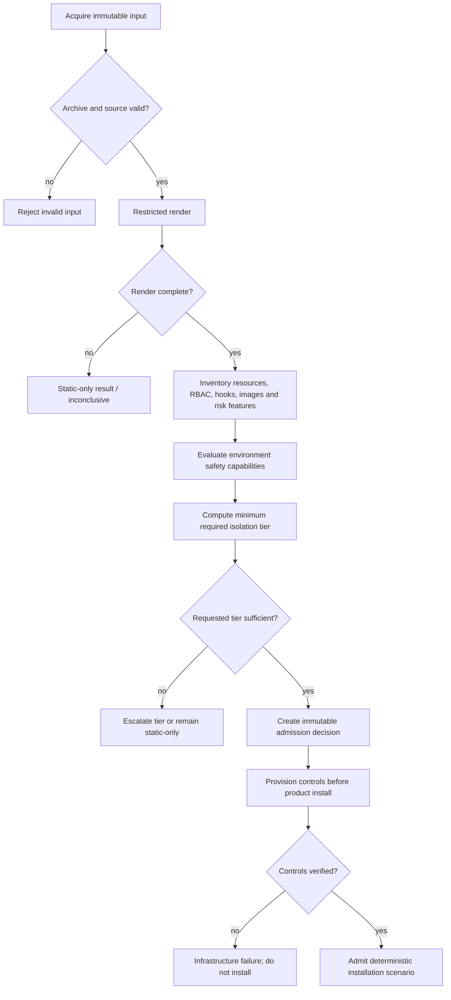

# Threat Model and Preflight Admission Policy

| Field | Value |
|---|---|
| Status | Long-term threat-model input; not the complete KubeProof v0.1 implementation plan |
| Scope | Local CLI, product acquisition, static analysis and Kubernetes execution |
| Protected environment | Developer workstation and future disposable runners |
| Last updated | 2026-09-21 |

> KubeProof v0.1 supports intentionally selected, known inputs on local kind and
> stops unsafe inputs at static analysis. Its narrower implementation boundary is
> defined in [`docs/v0.1/architecture.md`](v0.1/architecture.md).

## 1. Purpose

This document answers a narrower question than the architecture overview:

> Given a product input and an execution environment, may kube-lab inspect it,
> render it, install it or execute experiments against it?

It defines the admission boundary before product code runs. It does not decide
whether the product is production-ready or compatible with a company profile.
Those are evaluation outcomes.

Three decisions must remain separate:

1. **Input validity:** can the input be acquired and parsed safely?
2. **Execution safety:** in which isolation tier, if any, may it run?
3. **Product compatibility:** what does static/runtime evidence say relative to
   the company profile?

A product can be safe enough to test but incompatible with the profile. It can
also require unsafe privileges that are already sufficient static evidence of a
constraint conflict, without ever being executed locally.

## 2. Security objectives and non-goals

### 2.1 Objectives

- Prevent untrusted product content from acquiring host or evaluator authority.
- Prevent agents and documentation from bypassing execution policy.
- Inspect all installable resources before Kubernetes mutation.
- Select an isolation tier from deterministic findings and declared trust.
- Bound CPU, memory, storage, time, network and cluster permissions.
- Preserve input digests, policy version, admission reasons and user decisions.
- Fail closed when safety-relevant analysis is incomplete.
- Make residual risk visible in the evaluation and final report.

### 2.2 Non-goals for the local MVP

- Containing a deliberate container/kernel escape on the developer workstation.
- Safely executing arbitrary repositories or images submitted by strangers.
- Proving that a trusted upstream artifact has no supply-chain compromise.
- Protecting real enterprise secrets placed inside the evaluation cluster.
- Providing multi-tenant isolation.
- Guaranteeing egress containment before a policy-enforcing CNI is installed and
  verified.

## 3. Assets and adversaries

### 3.1 Assets

The primary assets are the host filesystem, container runtime/daemon, host
kernel, developer credentials, SSH/cloud/Kubernetes configuration, local network,
evaluation database, artifact store and integrity of published reports.

Inside an evaluation, synthetic credentials and generated test data are assets
because their disclosure demonstrates product behavior. They must not be confused
with production secrets.

### 3.2 Adversary classes

| Class | Example | Expected treatment |
|---|---|---|
| Accidental defect | A chart creates an unbounded Job | Tier 1 may test if resource controls exist |
| Over-privileged product | An operator requests cluster-admin | Static evidence locally; Tier 2 for runtime need |
| Compromised dependency | A trusted image tag is replaced | Digests/signatures where available; Tier 1 residual risk |
| Malicious product input | Chart mounts host paths and exfiltrates data | Tier 0 locally; Tier 2 only |
| Malicious documentation | README instructs an agent to run a command | Treat purely as untrusted data |
| Curious local user | Attempts a CLI force flag to bypass policy | No local hard-deny override; choose a stronger tier |

## 4. Trust declarations

An evaluation input has a user-declared trust class:

- `trusted_known`: the user intentionally selected a known product and source;
- `unverified`: provenance or contents have not been reviewed;
- `adversarial`: the evaluation intentionally tests potentially malicious input.

The declaration can only restrict admission. Static analysis may downgrade a
`trusted_known` input, but it cannot upgrade `unverified` to trusted. Reputation,
popularity or an LLM statement never upgrades trust.

Trust applies separately to:

- product package/chart/repository;
- referenced container images;
- Python company-profile module;
- MCP/tool provider;
- documentation source.

A trusted chart with mutable third-party image tags is not fully trusted. A
Python profile is executable host code and is imported only from a local source
the user explicitly trusts. A hosted service must never import an uploaded Python
profile.

## 5. Isolation tiers

| Tier | Execution boundary | Permitted activity | Intended inputs |
|---|---|---|---|
| Tier 0 — static | Restricted acquisition/rendering process; no product workload | Parse, render, inspect, index documentation | Any structurally valid input |
| Tier 1 — local lab | kind on the developer container runtime | Install and deterministic experiments within hard local policy | Explicitly `trusted_known` products only |
| Tier 2 — disposable sandbox | Fresh dedicated VM containing runtime and kind | Higher-risk and unknown product execution | `unverified`, privileged or adversarial inputs |
| Tier 3 — managed target | Explicit external cluster provider | Approved scenario subset; read-only by default | Organization-controlled validation |

Tier describes the isolation boundary, not the evaluation quality. A Tier 2 run
can still be inconclusive, and a Tier 0 static violation can be high severity.

### 5.1 Tier 1 capability caveat

The first vertical slice may not yet include a policy-enforcing CNI. Until
network enforcement is installed and verified:

- Tier 1 admits only explicitly trusted known products;
- the environment capability records `egress_containment=false`;
- no private credentials, source code or sensitive documents enter the cluster;
- no claim of blocked egress or metadata protection may be made;
- the report lists unrestricted workload egress as a test-environment limitation.

At the network milestone, Tier 1 gains a pinned CNI profile. Admission must test
that policy enforcement works before relying on it; merely installing a CNI is
not evidence of containment.

### 5.2 Environment component trust roles

Every installed component has one role within a child evaluation:

- **environment substrate:** trusted, pinned infrastructure such as CNI, DNS or
  storage, installed before the product;
- **environment add-on:** trusted platform behavior such as service mesh, policy
  or observability, installed as part of the enterprise blueprint;
- **experiment instrumentation:** trusted, scoped collector or fault injector;
- **product under test:** untrusted evaluation subject whose behavior,
  privileges and resource use become product evidence.

The same component instance cannot be both trusted environment and product under
test. Testing a CNI as the product uses Tier 2 outer VM/firewall isolation because
a broken or malicious datapath cannot be trusted to contain its own traffic.
Testing a normal product under Cilium and Istio ambient treats those pinned
components as environment; their configuration and verified capabilities remain
part of every evidence provenance chain.

## 6. Preflight pipeline

### 6.1 Acquire and pin

- Accept a supported chart repository/OCI reference or bounded local directory.
- Resolve the exact chart version and record package/content digest.
- Treat mutable versions/tags as a limitation; do not describe them as
  reproducible.
- Enforce compressed size, expanded size, file count and path-length limits.
- Reject path traversal, device files and links escaping the extraction root.
- Fetch chart dependencies only through the acquisition adapter, with bounded
  domains, size, time and recorded digests.
- Do not load Helm plugins or arbitrary download helpers.

### 6.2 Restricted render

- Invoke a pinned Helm executable through a typed argv adapter, never a shell.
- Disable arbitrary plugins and post-renderers.
- Use a temporary, capability-scoped working directory without host credentials.
- Apply bounded timeout and output size.
- Preserve raw rendered YAML and Helm stderr/exit code as static observations.
- Use safe YAML parsing with document/object count and nesting limits.
- Inventory hook manifests but do not execute them during preflight.

Rendering is not harmless enough to run without limits: it processes attacker
controlled templates and archives through external tooling. It is nevertheless a
substantially narrower boundary than starting product containers.

### 6.3 Inventory

Static analysis records at least:

- resource kinds, API groups, namespaces and cluster-scoped resources;
- Helm hooks and their lifecycle annotations;
- workloads, init/ephemeral containers, images and pull policies;
- security contexts, capabilities, seccomp, user and filesystem settings;
- host namespaces, host ports, host paths, devices and volume types;
- service accounts, roles/bindings, wildcard and sensitive RBAC permissions;
- CRDs, conversion webhooks, admission webhooks and APIService objects;
- Services, Ingress/Gateway, external IPs and declared endpoints;
- resource requests/limits, replica counts, Jobs and DaemonSets;
- secrets/configuration references and environment-derived credentials.

Unknown or unparsed resource kinds are safety-relevant unknowns. Tier 1 fails
closed unless a registered analyzer explicitly classifies them.

## 7. Admission outcomes

The policy returns exactly one outcome:

| Outcome | Meaning |
|---|---|
| `admit` | Requested tier and environment capabilities satisfy current policy |
| `escalate` | Runtime evaluation is allowed only in a stronger named tier |
| `static_only` | Preserve static evidence; do not execute product workloads |
| `reject_invalid` | Input is malformed, unverifiable or unsafe even to process further |
| `infrastructure_blocked` | Required safety control could not be provisioned or verified |

Each `AdmissionDecision` contains evaluation/input digest, policy version,
requested and minimum tier, matched rule IDs, missing capabilities, residual
risks, timestamp and actor. It is immutable. Re-evaluation under a new policy
creates a new decision.

There is no `--force-unsafe-local` escape hatch for hard-deny rules. The user can
select Tier 2 or stop at static analysis. An acknowledgement may accept documented
residual risk for an otherwise admitted trusted input; it cannot change the
minimum tier computed by policy.

## 8. Proposed Tier 1 rules

These rules are intentionally conservative and remain proposed until tested
against the first reference chart.

### 8.1 Immediate Tier 2 escalation

Any of the following raises the minimum tier to Tier 2:

- privileged containers or Windows HostProcess;
- `hostPID`, `hostIPC` or `hostNetwork`;
- hostPath volumes, host devices or unmasked `/proc` access;
- dangerous capabilities such as `SYS_ADMIN`, `SYS_MODULE`, `BPF`, `PERFMON`,
  `SYS_PTRACE`, `NET_ADMIN` or `NET_RAW` when not explicitly required by a
  reviewed scenario;
- unrestricted cluster-admin or RBAC permissions to escalate, bind, impersonate,
  mutate nodes, access node proxy, or create/update RBAC broadly;
- ability to mutate kube-lab safety namespaces, policies or admission controls;
- arbitrary external admission/conversion webhook URLs;
- static pods, node-level runtime configuration or container-runtime sockets;
- unverified/adversarial trust declaration;
- unknown resource types that may execute code or change admission/control-plane
  behavior;
- hooks that require any of the capabilities above.

The list is policy data with stable rule IDs, not prompt text interpreted by an
agent.

### 8.2 Tier 1 admit-with-controls candidates

The following are not automatically safe, but may run when their controls and
analyzers exist:

- namespaced Deployments, StatefulSets, Jobs and Services;
- CRDs with structural schemas and no external conversion URL;
- scoped ClusterRoles required to observe declared custom resources;
- in-cluster webhooks whose service, namespace, RBAC and failure policy pass
  review;
- DaemonSets without host access, under bounded node resources;
- Helm hooks that pass the same workload/RBAC rules as ordinary resources.

For the first vertical slice, hooks remain disabled by default. A chart that
cannot install without them is static-only or Tier 2 until hook lifecycle and
cleanup are implemented and tested. This restriction can later be relaxed by a
versioned policy change, not an ad hoc flag.

### 8.3 Required controls before Tier 1 installation

- A fresh dedicated kind cluster with no unrelated workloads or credentials.
- Synthetic kubeconfig and registry credentials scoped to this evaluation.
- Namespace labels and an admission policy enforcing the chosen Pod Security
  baseline.
- Explicit prohibition on product mutation of kube-lab control resources.
- Namespace ResourceQuota/LimitRange plus container-runtime/node resource caps.
- Wall-clock deadline, pod/object count limits and an external watchdog.
- Metadata-service destinations blocked when network enforcement is available;
  otherwise absence of cloud credentials and an explicit limitation.
- Artifact/log size caps and redaction before durable storage.
- Complete inventory before install and complete leftover inventory afterward.
- Cluster destruction as the final recovery boundary; a cleanup failure
  quarantines then destroys the environment.

Controls are verified with probes before installation. Configuration intent is
not evidence that a control works.

## 9. RBAC and cluster-scoped resources

Cluster scope is not itself a denial condition: CRDs and narrowly scoped
ClusterRoles are legitimate operator requirements. Admission evaluates effective
authority, not only resource kind.

The installer identity is separate from product service accounts. It may create
only the preflight-approved resource set. Product identities receive the rendered
bindings, subject to hard policy. The application records a normalized RBAC diff
and detects wildcards, sensitive subresources and escalation paths.

If safe installation would require modifying the chart's permissions, kube-lab
does not silently patch them. It may run a separately labelled remediation
experiment later, but the primary evaluation must first record behavior of the
declared product configuration.

## 10. Network and data handling

Tier 1 receives no host-mounted source repository, home directory, Docker socket,
SSH agent, cloud credentials or production kubeconfig. Product inputs are copied
by digest into a bounded staging area.

When supported, workload networking starts default-deny and scenarios open only
declared flows. Image pulling occurs through the node/runtime boundary and is
recorded separately from pod egress. DNS and flow observation must avoid storing
sensitive payloads; packet capture is opt-in and Tier 2 by default.

Every environment component is installed from a pinned, trusted artifact and
verified before product admission. CNI verification covers basic Pod/Service/DNS
connectivity, positive and negative policy probes for each claimed capability,
and collector health where flow evidence is expected. Service-mesh verification
covers enrollment, required traffic paths, identity/mTLS state and health-probe
behavior. Configuration, dependencies, kernel/runtime prerequisites and digests
are part of the environment fingerprint.

Environment overhead is measured before product installation. Reports preserve
raw cluster usage and product-over-baseline deltas; they must not attribute CNI,
ztunnel or telemetry DaemonSet CPU/memory directly to the evaluated product.
Variant comparison is valid only when product digest, Kubernetes node image,
topology, profile, unchanged component configuration, scenario versions and
parameters are held constant or differences are disclosed.

External endpoints discovered in manifests, DNS or flows are untrusted data.
The evaluator must not follow arbitrary product URLs from the host without SSRF,
scheme, redirect and address-range controls.

## 11. Failure and recovery

- Acquisition/render/parser failure produces static infrastructure evidence and
  no product-runtime conclusion.
- Safety-control verification failure is `infrastructure_blocked`; installation
  does not begin.
- Kubernetes admission rejection caused by the company profile is a valid
  product observation when the test infrastructure is healthy.
- Watchdog or node failure is classified independently from product behavior.
- Cleanup failure seals collected evidence, marks the environment quarantined and
  destroys the cluster/runtime boundary.
- Host-level anomalies terminate the evaluation and require manual review; the
  system does not retry potentially hostile execution automatically.

## 12. Prompt-injection boundary

README files, chart notes, values descriptions, labels, annotations, logs, error
messages and MCP output are untrusted content. They may contribute claims or
observations but cannot:

- change trust class or minimum isolation tier;
- add executables, plugins, post-renderers or URLs to an action plan;
- increase permissions, budgets or timeouts;
- waive a matched admission rule;
- populate typed tool arguments without field-specific validation;
- create an accepted evidence record without collector provenance.

Policy decisions are computed from typed parsed fields and environment
capabilities. LLM output is not an input to hard safety rules.

## 13. Audit and reporting

Persist and report:

- requested input identity, resolved version and digest;
- declared trust for each input class;
- renderer, analyzer and admission-policy versions;
- requested, minimum and actual isolation tier;
- every matched rule and missing environment capability;
- control-verification evidence;
- user acknowledgement of residual risk;
- whether egress, resource and privilege containment were actually verified;
- rejected, skipped and not-tested scenarios;
- cleanup and environment-destruction outcome.

A report must never summarize `kind` as “sandboxed” without the tier and verified
capabilities. Preferred wording is precise: “executed in a disposable local kind
cluster; hostile-code isolation was not provided.”

## 14. Security validation strategy

Build intentionally small fixtures for:

- archive path traversal and decompression bombs;
- malicious Helm notes/values prompt injection;
- privileged, host namespace and hostPath workloads;
- cluster-admin and RBAC escalation paths;
- external and in-cluster webhooks;
- unsafe hooks and finalizers that block cleanup;
- missing resource limits and resource exhaustion;
- mutable image tags and disallowed registries;
- DNS/HTTP attempts toward metadata and private address ranges;
- unknown custom resources;
- failure of each required safety-control probe;
- attempted policy override through CLI, agent message or documentation.

Assertions check admission outcome and rule IDs, not only error text. No fixture
with host-impacting behavior runs on an ordinary developer/CI host; Tier 2 tests
require an explicitly isolated runner.

## 15. Residual risks and review points

Even admitted Tier 1 inputs retain supply-chain, container-runtime and kernel
risk. Static analyzers can miss generated/runtime behavior. Image signatures
establish provenance, not benign behavior. Network controls may not observe every
protocol or namespace. Resource limits reduce, but do not eliminate, host denial
of service.

Before implementing admission, the design review must choose:

1. the first reference chart used to test whether Tier 1 rules are practical;
2. whether Milestone 1 accepts unrestricted egress as a declared trusted-input
   limitation or pulls a policy-enforcing CNI into the vertical slice;
3. the Pod Security baseline and mechanism that product RBAC cannot disable;
4. exact resource and archive limits for the supported development environment;
5. how image identity is pinned when upstream charts specify mutable tags.
6. which enterprise baseline is implemented first and which single environment
   variant will prove component composition without creating a broad matrix.

The recommended default is to preserve the small vertical slice: accept
unrestricted egress only for a pinned, explicitly trusted reference product with
no sensitive host/test data, then add verified network enforcement at the
network milestone. This recommendation should be reversed if the first product
cannot reasonably be considered trusted.
