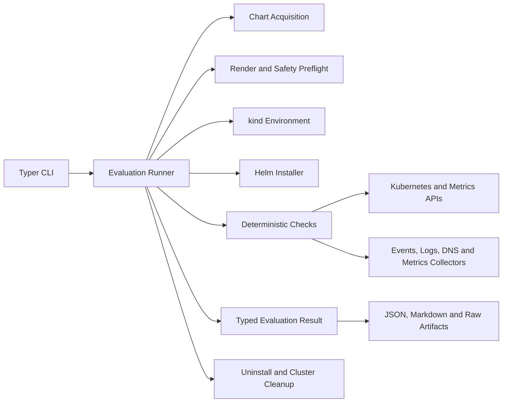

# KubeProof v0.1 Architecture

| Field | Value |
|---|---|
| Status | **Accepted implementation architecture** |
| Product thesis | AI investigates; the runtime proves |
| Current implementation milestone | Milestone 2 — Evidence completed; Milestone 3 pending |
| Last updated | 2026-09-23 |

## 1. Objective

KubeProof answers:

> Can this Kubernetes product run under the constraints represented by this
> profile, and what collected evidence supports the answer?

v0.1 optimizes for useful output, reproducibility, safety and implementation
velocity. It does not implement the complete future agent platform.

## 2. Current invariants

- Deterministic code executes checks and determines rule-based outcomes.
- Every finding references observations collected in the same evaluation.
- Documentation claims, static observations and runtime observations are
  different source classes.
- Infrastructure failure cannot become product failure.
- Reports render existing evaluation state and cannot introduce facts.
- kind is disposable test infrastructure, not hostile-code isolation.
- External tools are invoked through typed argument-vector adapters, never an
  arbitrary shell interface.
- Unknown or untested behavior remains visible; it is not converted to pass.

The detailed accepted output semantics are in
[`truth-contract.md`](truth-contract.md).

## 3. Milestone 1 architecture

KubeProof is a synchronous, single-process modular CLI. An
`EvaluationRunner` owns one explicit workflow. There is no database, message bus,
plugin loader, AI component or general workflow engine.



### 3.1 Modules

| Module | Responsibility |
|---|---|
| `cli` | Commands, options, progress and exit codes |
| `profiles` | Validate the small versioned YAML company profile defined in [`profile.md`](profile.md) |
| `inputs` | Resolve Helm repository/OCI input, version, values and metadata |
| `preflight` | Render manifests, inventory resources and enforce local safety policy |
| `environment` | Create, inspect and destroy one kind cluster |
| `helm` | Typed render/install/status/uninstall operations |
| `kubernetes` | Narrow API reads, watches and resource operations |
| `checks` | Five explicit deterministic checks |
| `collectors` | Events, statuses, logs, CoreDNS queries and Metrics API samples |
| `model` | Typed specifications, observations, findings and outcomes |
| `reporting` | Deterministic canonical JSON and Markdown rendering |
| `bundle` | Run-directory layout and raw artifact writes |
| `logging` | Correlated structured diagnostic logs |

### 3.2 Execution flow

1. Validate profile, chart reference, values and local prerequisites.
2. Create the run directory and initial input metadata.
3. Resolve and pin the chart version where the source permits it.
4. Render the chart and run static safety/footprint analysis.
5. Produce a static-only result if local execution is not admitted.
6. Create a fresh kind cluster with fixed resource and time bounds.
7. Install and verify pinned evaluation infrastructure such as Metrics Server
   and CoreDNS query instrumentation.
8. Install the product with Helm under a deterministic timeout.
9. Inventory created resources and wait for supported workload readiness.
10. Run eligible security, resource, recovery and network/DNS checks.
11. Build one typed `EvaluationResult`.
12. Render canonical JSON and Markdown from that result.
13. Uninstall the product, inspect leftovers and destroy the cluster.
14. Finalize the run directory.

Cleanup is attempted after all terminal paths. Cleanup failure is recorded
separately and cannot rewrite already collected observations.

### 3.3 Minimal domain concepts

- `EvaluationSpec`
- `CompanyProfile`
- `ProductInput`
- `EnvironmentInfo`
- `CheckExecution`
- `Observation`
- `Finding`
- `ArtifactRef`
- `EvaluationResult`

Checks use independent execution and assessment axes defined by the truth
contract. Milestone 1 does not need an event-sourced aggregate or mutable global
blackboard.

### 3.4 Check catalogue

Milestone 1 has exactly these product-facing check areas:

1. Helm installation and supported workload readiness;
2. RBAC and workload-security footprint;
3. declared resources and Metrics API sampled usage;
4. Deployment Pod termination and replacement readiness;
5. static external endpoints and observed external DNS queries.

Uninstall/leftover inspection and infrastructure health are runner responsibilities,
not additional product readiness domains.

### 3.5 Persistence

The filesystem evaluation bundle is the persistence model:

```text
kubeproof-run/
├── evaluation.json
├── report.md
├── profile.yaml
├── input/
│   ├── chart-metadata.json
│   └── rendered-manifests.yaml
└── artifacts/
    ├── helm/
    ├── kubernetes/
    ├── installation/
    ├── security/
    ├── resources/
    ├── recovery/
    ├── network/
    └── cleanup/
```

SQLite is not part of Milestone 1. Milestone 2 may add it for indexing, resume or
transactional finalization, while the exportable bundle remains authoritative.

### 3.6 Safety boundary

Milestone 1 executes only intentionally selected, known products. Static
preflight runs before cluster mutation. Inputs that require unsupported host-level
access stop at static analysis. The cluster contains no production credentials or
sensitive data. Time/resource limits and cleanup are mandatory.

This boundary is intentionally narrower than the historical isolation-tier
design. Disposable-VM execution becomes necessary when the product accepts
unknown submissions, privileged products or shared-service workloads.

## 4. Technology baseline

- Python 3.12+
- Pydantic for typed boundaries and canonical serialization
- Typer for CLI commands
- pytest for tests
- Ruff for formatting and linting
- mypy in strict mode as the initial static type checker
- official Kubernetes Python client
- pinned Helm and kind executables through typed adapters
- Metrics Server serving the Kubernetes Metrics API
- no AI or agent framework
- no MCP
- no database
- no async unless a concrete collector/watch requires it

## 5. Four milestones

### Milestone 1 — Proof

Deliver the architecture above against at least three pinned real public
products. Each check produces supported evidence or an explicit untested result.
Static results repeat across identical inputs, infrastructure failures never
become product findings, unsafe inputs stop at static analysis, and cleanup paths
are tested. No AI, MCP, database or plugin framework is required.

The initial product corpus is cert-manager, Argo CD and kube-prometheus-stack.
For kube-prometheus-stack, evaluate both the default rendered footprint and a
documented locally admissible values set if host-level components prevent runtime
execution.

### Milestone 2 — Evidence

Add schema-versioned and sealed observations, environment/tool fingerprinting,
experiment versions, artifact hashes, provenance, offline bundle validation and
strong source-class separation. Demonstrate tamper detection, deterministic
reporting from evaluation state and reproducibility within documented runtime
tolerances. Add SQLite only for a demonstrated local indexing/resume need.

The implemented bundle contract and validation procedure are documented in
[`evidence.md`](evidence.md). The local history feature already uses SQLite as a
rebuildable query index, following accepted decision D-006.
Two independent runtime pairs, cert-manager and Argo CD, met the documented
repeatability criteria after the CPU tolerance was fixed before collection.
The earlier relative-only CPU comparison failure remains recorded in the
evidence log.

### Milestone 3 — Intelligence

Add one bounded Reasoner that can request only registered typed experiments.
Deterministic code validates requests, executes actions and stores evidence. An
eval corpus must show grounded improvement over the non-AI baseline, zero
unauthorized execution, bounded cost/iterations and valid evidence references.
Multiple agents require separate measurable justification.

### Milestone 4 — Product

Ship easy installation, polished CLI, GitHub Action, version comparison,
regression comments, reusable profiles, stable shareable bundles, published
evaluations and excellent documentation. Exit requires at least one external
engineer to complete an evaluation and use the output in a real decision.

## 6. Explicitly absent from Milestone 1

- LLMs or agents;
- MCP;
- LangGraph, Agents SDK, LangChain or Temporal;
- scenario plugin loading;
- SQLite/PostgreSQL;
- distributed execution or concurrency control;
- environment/CNI/service-mesh matrices;
- RAG and documentation ingestion;
- arbitrary shell or unrestricted kubectl;
- production-readiness scores.

These are reversible omissions. Each has an observable adoption or complexity
signal documented in [`decisions.md`](decisions.md).
